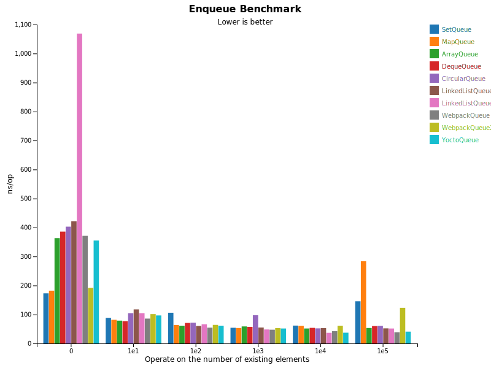

# elite-queue

[](https://996.icu/#/en_US)
[](https://github.com/996icu/996.ICU/blob/master/LICENSE)

[](https://badge.fury.io/js/elite-queue)

The fastest queue implementation in the world.

## Installation

```bash
npm install elite-queue --save
```

## Usage

```js
// import via esm
import { Queue } from "elite-queue";

// import via cjs
const { Queue } = require("elite-queue");
```

## Benchmark




## License

The [Anti 996 License](LICENSE)
